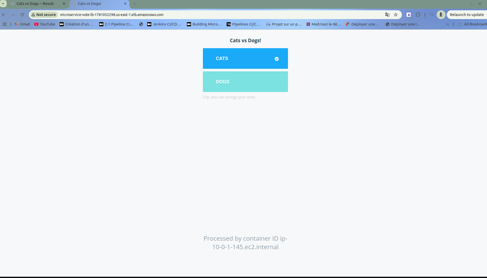
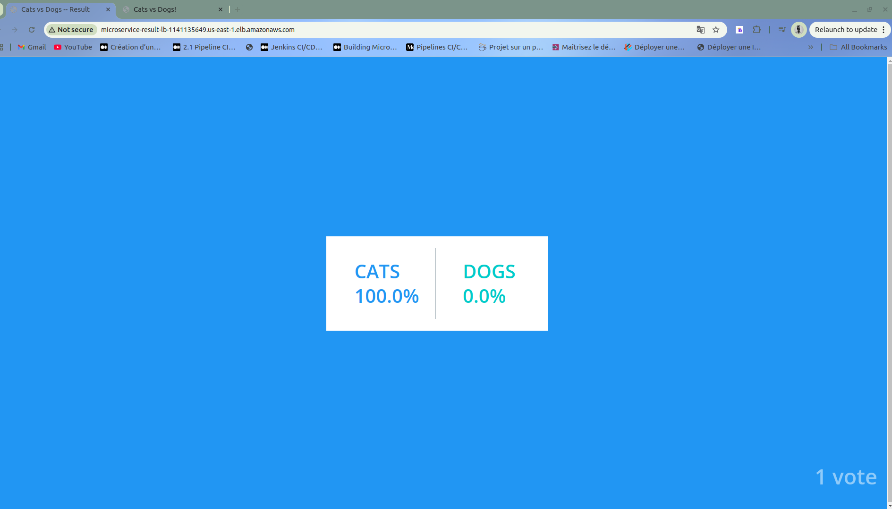
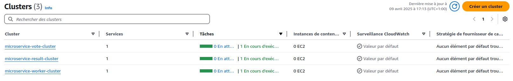
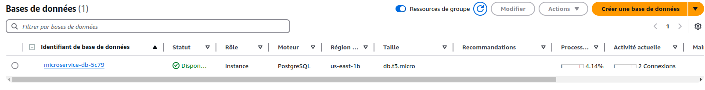
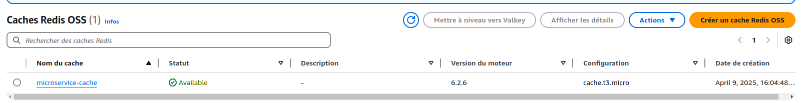
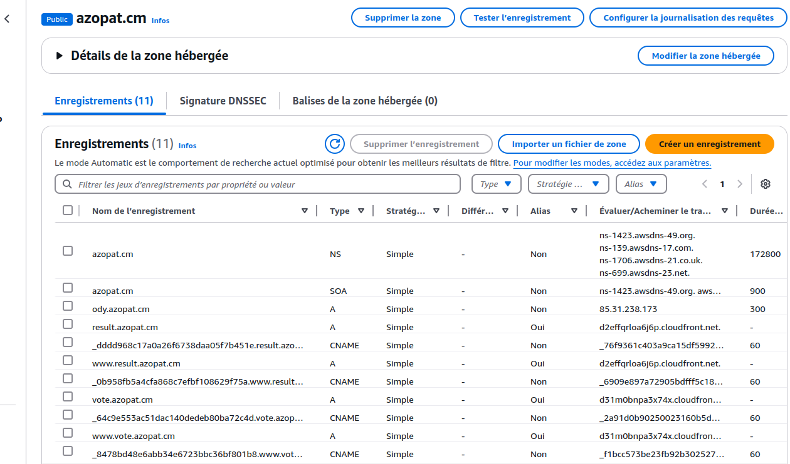
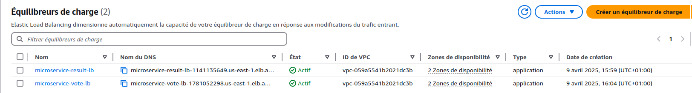

# 🗳️ Voting App - Déploiement AWS avec Terraform

Ce projet est une adaptation du projet open source [example-voting-app](https://github.com/dockersamples/example-voting-app), déployé entièrement sur AWS en utilisant une architecture modulaire avec Terraform.

### Architecture du projet


## 📌 Objectif

Ce projet démontre un déploiement cloud complet et sécurisé d'une application distribuée, avec :
- Microservices déployés sur **AWS ECS Fargate**
- Base de données gérée avec **RDS PostgreSQL**
- File d’attente avec **ElastiCache Redis**
- Provisionnement via **Terraform** modulaire
- Sécurité et performance via **CloudFront**, **WAF**, **ACM**, **Route53**

## 📁 Arborescence du projet

```bash
├── main.tf
├── modules
│   ├── aws-waf-cdn-acm-route53
│   ├── database
│   ├── iam
│   ├── networking
│   ├── redis
│   ├── result-service
│   ├── vote-service
│   └── worker-service
├── outputs.tf
├── providers.tf
├── terraform.tfvars
├── variables.tf
└── versions.tf
```

Chaque module est autonome et contient ses propres `variables.tf`, `main.tf` et `outputs.tf`.

## 🔧 Technologies utilisées

- Terraform v1.x
- AWS ECS Fargate
- AWS RDS (PostgreSQL)
- AWS ElastiCache (Redis)
- AWS Route 53, ACM, CloudFront, WAF

## ⚙️ Services déployés

- `vote-service` : Interface utilisateur pour voter
- `result-service` : Interface utilisateur pour afficher les résultats
- `worker-service` : Service de traitement des votes en arrière-plan
- `database` : PostgreSQL (AWS RDS)
- `redis` : Redis (AWS ElastiCache)
- `load balancer` : Load Balancer (intégré à CloudFront ou utilisé directement)

## 🧪 Pré-requis

- Un compte AWS avec les droits nécessaires
- Terraform installé (`terraform -v`)

## 🚀 Déploiement

1. Clonez ce dépôt :
   ```bash
   git clone https://github.com/DJTJ21/MICROSERVICE-DEPLOY-WITH-ECS-TERRAFORM.git
   cd MICROSERVICE-DEPLOY-WITH-ECS-TERRAFORM
   ```

2. Configurez les variables dans `terraform.tfvars`

3. Initialisez le projet :
   ```bash
   terraform init
   ```

4. Appliquez le plan d'infrastructure :
   ```bash
   terraform apply
   ```

## 📸 Résultats et captures

### Application Vote



### Application Result



### Services AWS

#### ECS Services



#### RDS & ElastiCache




#### DNS & Load Balancer




## 📈 Avantages de cette architecture

- Haute disponibilité avec Fargate
- Scalabilité automatique
- Gestion des secrets et sécurité AWS native
- Infrastructure modulaire et réutilisable
- Prête pour GitOps et CI/CD

## 🧠 À propos

Ce projet est un laboratoire DevOps / Cloud visant à démontrer une architecture propre et réaliste d'application conteneurisée sur AWS.

---

> 🤝 N’hésitez pas à ouvrir une issue ou une PR pour contribuer à l’amélioration de ce projet.
```

